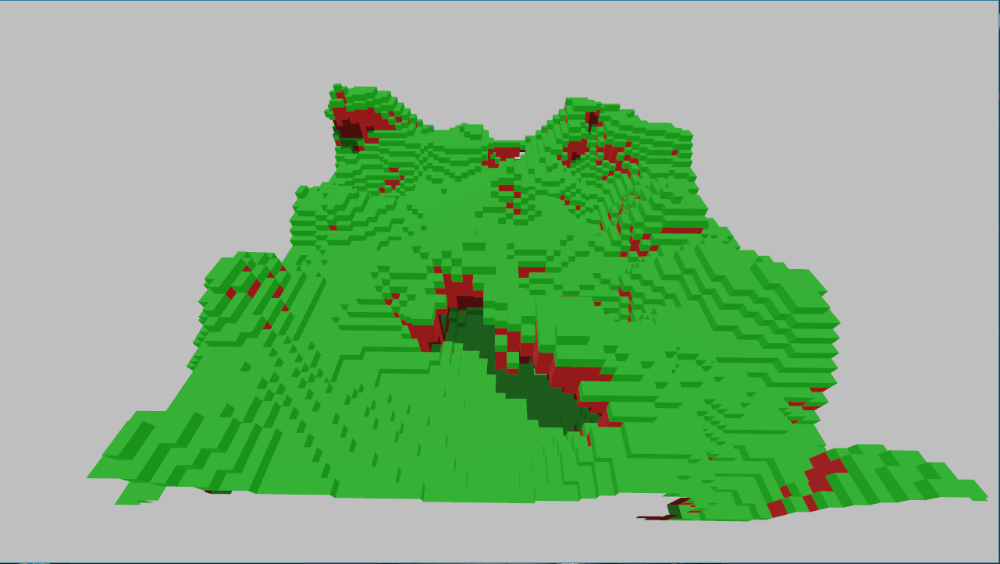
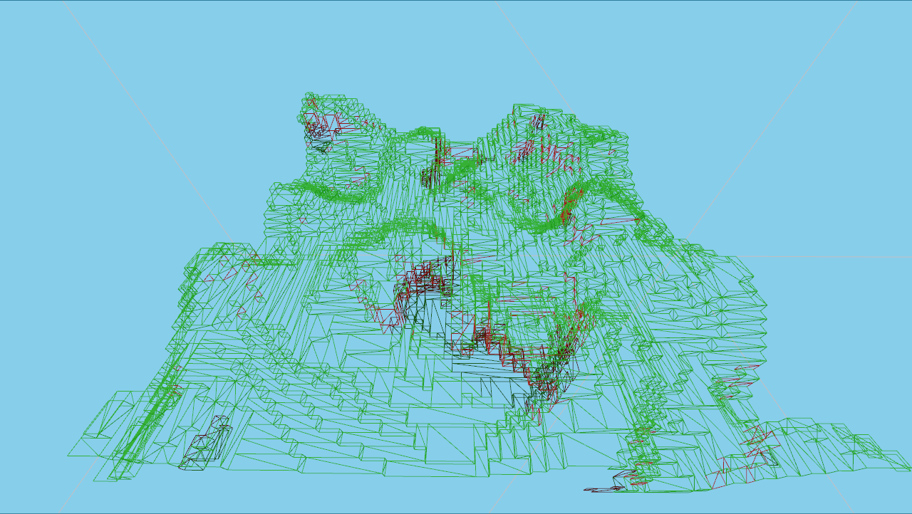
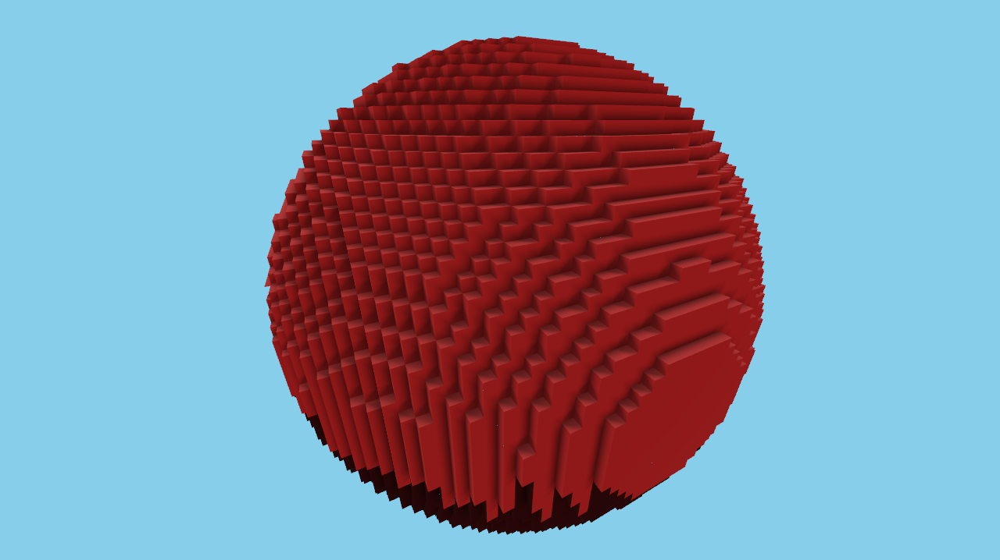
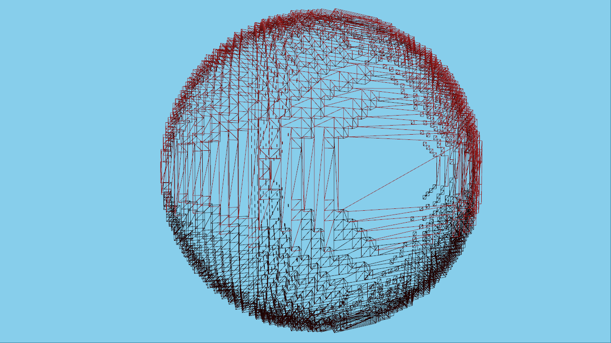
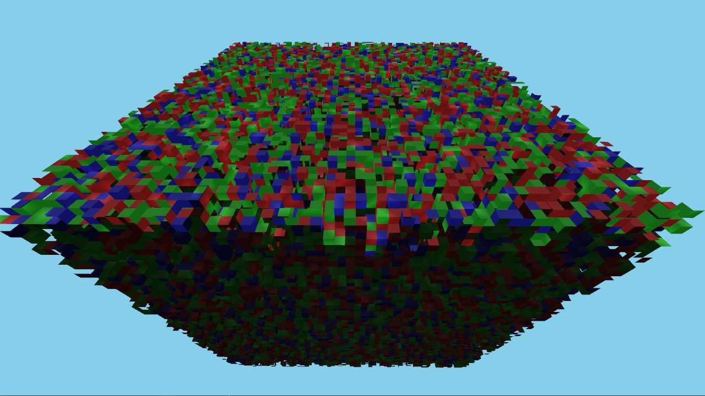
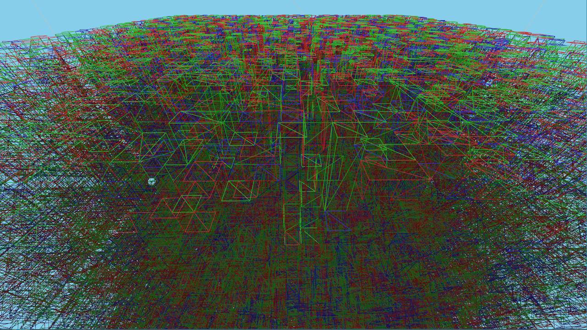
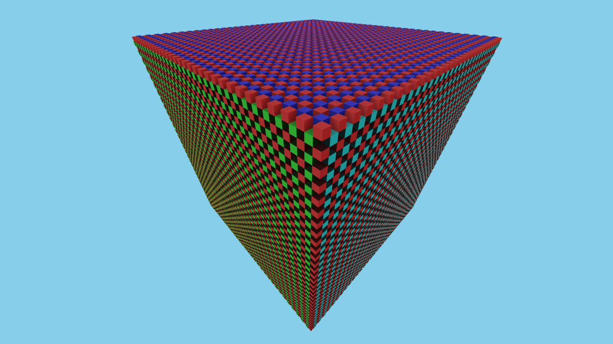
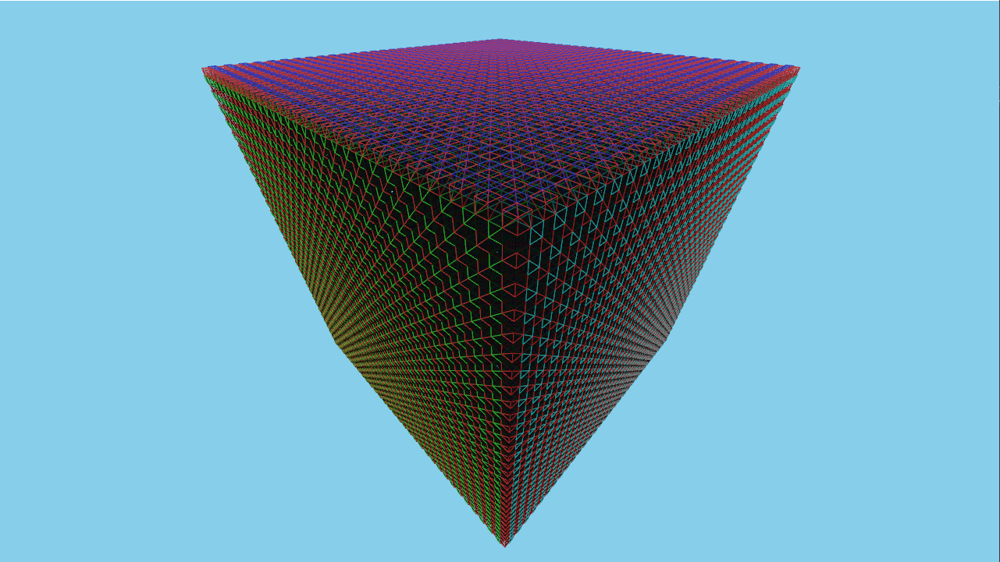

# Binary Greedy Meshing

Fast voxel meshing algorithm that creates 'greedy' meshes using extremely fast bitwise operations. Supports voxel types and bakes ambient occlusion.

This repository serves as a simple example project for the algorithm.

Demo of a larger world: https://www.youtube.com/watch?v=LxfDmF0HxSg

**UPDATE: 2024-04-19:**  
**The ambient occlusion implementation was fixed - it should look better now.**

**UPDATE: 2024-04-21:**  
**Optimized the code to be up to 25% faster.**

**UPDATE: 2024-04-25:**  
**Optimized the code to be up to 15% faster and allocate less memory on every run.**

## Setup example (Visual Studio)
```
> git clone https://github.com/cgerikj/binary-greedy-meshing --recursive
> cd binary-greedy-meshing
> mkdir build && cd build
> cmake .. -G "Visual Studio 17 2022"
> start binaryMesher.sln
> (Switch to Release Mode / RelWithDebInfo)
```

## Demo usage

- Noclip: WASD
- Toggle wireframe: X
- Regenerate: Spacebar
- Cycle mesh type: Tab

Meshing duration is printed to the console.

## How to use the mesher
The main implementation is in src/mesher.h

### Input data:  
**- std::vector<uint8_t>& voxels**  
&nbsp;&nbsp;&nbsp;&nbsp; - The input data includes duplicate edge data from neighboring chunks which is used for visibility culling and AO. For optimal performance, your world data should already be structured this way so that you can feed the data straight into this algorithm.  
&nbsp;&nbsp;&nbsp;&nbsp; - Input data is ordered in YXZ and is 64^3 which results in a 62^3 mesh. 

**- MeshData& meshData**  
&nbsp;&nbsp;&nbsp;&nbsp; - Data that needs to be allocated once (per thread if meshing with multiple threads)  

**- bool bake_ao**  
&nbsp;&nbsp;&nbsp;&nbsp; - true if you want baked ambient occlusion.  

### Output data:  
&nbsp;&nbsp;&nbsp;&nbsp; - The allocated vertices in MeshData with a length of meshData.vertexCount.

## Mesh details

Vertex data is packed into one unsigned integer:
- x, y, z: 6 bit each (0-63)
- Type: 8 bit (0-255)
- Normal: 3 bit (0-5)
- AO: 2 bit

Meshes can be offset to world space using a per-draw uniform or by packing xyz in gl_BaseInstance if rendering with glMultiDrawArraysIndirect.

## Screenshots
| Mesh                       | Wireframe                  |
| -------------------------- |:--------------------------:|
|   |   |
|   |   |
|   |   |
|   |   |

## Benchmarks
Average execution time running on a Ryzen 3800x.

| Scene                   | Microseconds   | Vertices   |
| -----------------------:|:--------------:|:----------:|
| 3d hills (AO)           | 552            | 43021      |
| 3d hills (No AO)        | 325            | 24751      |
| Red sphere (AO)         | 656            | 71533      |
| Red sphere (No AO)      | 317            | 43201      |
| Empty (AO)              | 148            | 0          |
| Empty (No AO)           | 125            | 0          |
| White noise (AO)        | 10211          | 1594069    |
| White noise (No AO)     | 3545           | 1415419    |
| 3d checkerboard (AO)    | 11696          | 4289904    |
| 3d checkerboard (No AO) | 6271           | 4289904    |

## Other resources
### Meshing in a minecraft game:
https://0fps.net/2012/06/30/meshing-in-a-minecraft-game/  

### Ambient occlusion for Minecraft-like worlds
https://0fps.net/2013/07/03/ambient-occlusion-for-minecraft-like-worlds/