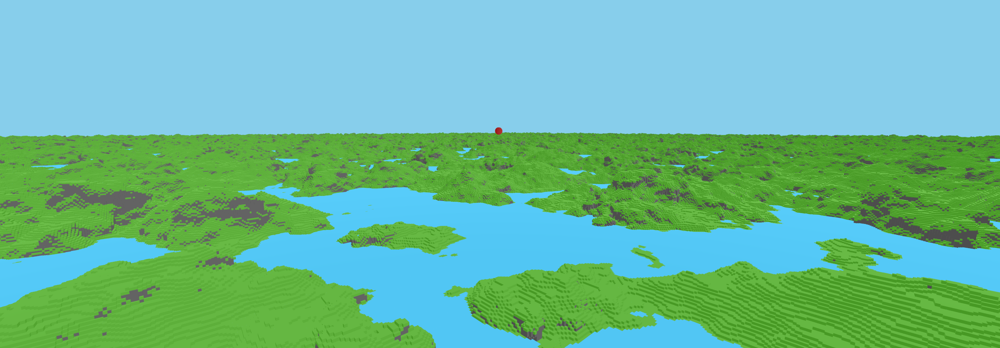
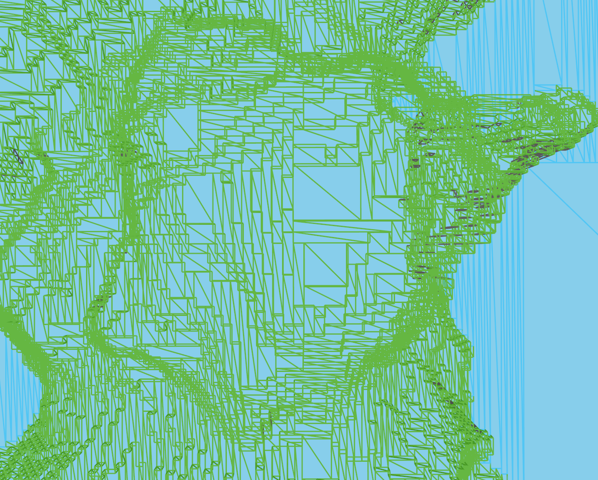

# Binary Greedy Meshing v2

<p float="left">
  
   
</p>

**Voxel meshing algorithm that creates large quads using extremely fast bitwise operations.**

**Version 2 is several times faster compared to version 1 thanks to contributions by:  
Ethan Gore ([Youtube Channel](https://www.youtube.com/@ethangore8697), [Github](https://github.com/kryyptor))  
Finding Fortune ([Youtube Channel](https://www.youtube.com/@Finding_Fortune), [Github](https://github.com/Finding-Fortune))**

Execution time for a single chunk typically ranges from **50us** to **200us**.  
The chunks in the screenshot were meshed at an average of **74us** single-threaded and **108us** in a thread pool. (Ryzen 3800x).

Chunks with a maximum size of 64x64x64 are supported, including neighboring chunk data.

**Check out the [v1.0.0](https://github.com/cgerikj/binary-greedy-meshing/tree/v1.0.0) branch for version 1 which supports baked AO.**

## How does it work?

### Step 1 - Generate occupancy mask
The first step, which is performed outside the main meshing function, is to create a binary opaque/occupancy mask of the chunk. A 64x64 array of 64-bit integers is generated where **0** means air and **1** means an opaque voxel. This data can be saved and updated for future re-meshing. It's also useful for physics and raycasting.

The demo does this in two different ways:
* World generation: **src/misc/noise.h: generateTerrainV1**
* Chunk decompression (RLE): **src/data/rle.h: decompressToVoxelsAndOpaqueMask**

### Step 2 - Generate face masks / hidden face culling
Bitwise operations are used to cull 64 faces at a time and create another data structure for visible faces. A 62x62 array of 64-bit masks is generated for each of the 6 faces. Each bit represents whether or not a face of a voxel faces air and should be visible.

### Step 3 - Greedy face merging
The masks from step 2 are iterated for each face and merged into larger quads. Bitwise operations are used to merge 64 faces at a time and the original voxel types are looked up to check whether or not two voxel faces can be merged into one. Step 3 is divided into two separate algorithms because it operates on data on two different planes.

**The vertices that are generated are 8 bytes per quad.**  
These are rendered using vertex pulling. The mesher can of course be modified to create 4/6 regular vertices per quad.

The first 4 bytes are packed like this: 6 bit x, 6 bit y, 6 bit z, 6 bit width, 6 bit height.  
The last 4 bytes only utilize 8 bits for voxel type data.

## Rendering
The demo project ships with a fast renderer that uses vertex pulling. All chunks are rendered in one draw call using glMultiDrawElementsIndirect. Faces facing away from the camera are not rendered.

## Demo
When the program is started, a 96x96 chunk (5952x5952 voxels) file is loaded from disk and meshed in a few seconds (multi-threaded).

Use these controls to fly around and swap between a few test/benchmark chunks. Meshing durations are printed to the console.

- Noclip: WASD
- Toggle wireframe: X
- Regenerate test chunk: Spacebar
- Cycle test mesh type: Tab

### Demo setup example (Visual Studio)
```
> git clone https://github.com/cgerikj/binary-greedy-meshing --recursive
> cd binary-greedy-meshing
> mkdir build && cd build
> cmake .. -G "Visual Studio 17 2022"
> start binaryMesher.sln
> (Switch to Release Mode / RelWithDebInfo)
```

## Other resources
#### Meshing in a minecraft game:
https://0fps.net/2012/06/30/meshing-in-a-minecraft-game/

#### Vertex pulling
https://voxel.wiki/wiki/vertex-pulling/