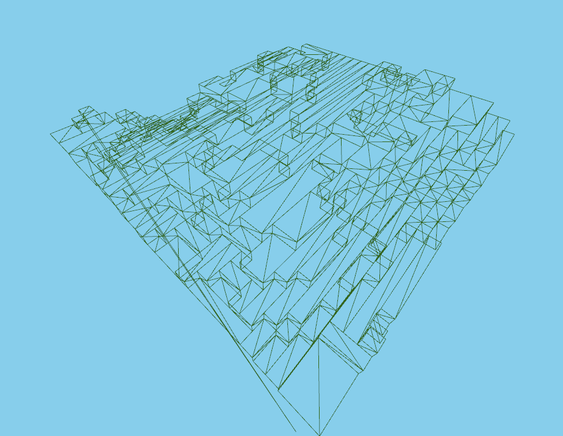

# Binary Greedy Meshing

This is a simplified branch, original: https://github.com/cgerikj/binary-greedy-meshing/tree/master

Fast voxel meshing algorithm - creates 'greedy' meshes.

## Benchmarks
Execution time running on Ryzen 3800x. 30^3 chunk. 1000x runs average.

| Scene             | Time elapsed   | Vertices   |
| ----------------- |:--------------:|:----------:|
| 3d hills          | 0.043 ms       | 3,012       |
| Red sphere        | 0.061 ms       | 11,160     |
| White noise       | 0.410 ms       | 135,342    |
| 3d checkerboard   | 0.881 ms       | 486,000    |
| Empty             | 0.026 ms       | 0          |



## Setup example (Visual Studio)
```
> git clone https://github.com/cgerikj/binary-greedy-meshing --recursive
> cd binary-greedy-meshing
> mkdir build && cd build
> cmake .. -G "Visual Studio 16 2019"
> start binaryMesher.sln
```

## Program usage

- Noclip: WASD
- Toggle wireframe: X
- Regenerate: Spacebar
- Cycle mesh type: Tab

Meshing duration is printed to the console.

## Algorithm usage
The mesher lives in src/mesher.h, go read it :)

Input data:
- std::vector<uint8_t> voxels (values 0-1 usable)

The input data includes duplicate edge data from neighboring chunks which is used for visibility culling.
Input data is ordered in YXZ and is 32^3 which results in a 30^3 mesh.

Output data:
- std::vector<uint16_t> of vertices in chunk-space.

## Mesh details

Vertex data is packed into one unsigned short:
- x, y, z: 5 bit each (0-31)

Meshes can be offset to world space using a per-draw uniform or by packing xyz in gl_BaseInstance if rendering with glMultiDrawArraysIndirect.